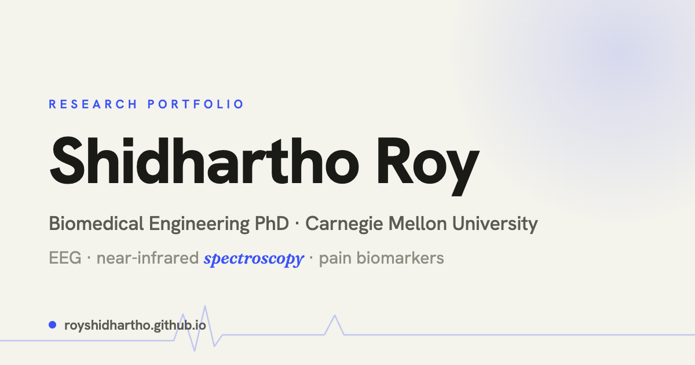

# Academic Portfolio — Astro + Tailwind

A clean, modern, light/dark portfolio template for **researchers and academics**, built with Astro 5 and Tailwind CSS v4. It extends the developer-focused [DevPortfolio](https://github.com/RyanFitzgerald/devportfolio) template with academic sections (Publications, Talks), a markdown blog, and a robust, **SEO + LLM-friendly** metadata layer out of the box.

**Live example:** [royshidhartho.github.io](https://royshidhartho.github.io)

> This repository doubles as one person's live site **and** a reusable template — the content you see is a working example. To make it yours, replace the content described in [Make it yours](#make-it-yours).

## Features

- 🎓 **Academic-first sections** — Hero, Talks, About, Projects, Publications (with domain filters + expandable abstracts), Experience, Education, Contact.
- 🌗 **Light/dark theme** — system-aware, persisted to `localStorage`, no flash of the wrong theme.
- 🔎 **SEO + LLM ready** — a reusable `<Seo />` component, JSON-LD structured data (`Person`, `WebSite`, `BlogPosting`, `BreadcrumbList`), canonical URLs, Open Graph + Twitter cards, auto-generated sitemap, an AI-crawler-friendly `robots.txt`, and an `llms.txt` index. See [SEO](#seo--llm-discoverability).
- ✍️ **Markdown blog** — drop a `.md` file in `src/posts/`; featured post + card grid handled for you.
- 📭 **Privacy-conscious contact** — a [Formspree](https://formspree.io) form with a honeypot, so no email address is exposed to scrapers.
- ♿ **No-JS friendly & accessible** — content renders without JavaScript; animations respect `prefers-reduced-motion`.
- 🧩 **Conditional sections** — empty config arrays hide their section (and nav link) automatically.

## Tech stack

- **[Astro 5](https://astro.build/)** — static site generator; every component is `.astro`.
- **[Tailwind CSS v4](https://tailwindcss.com/)** — via the `@tailwindcss/vite` plugin (configured in `astro.config.mjs`; there is **no** `tailwind.config.js`). All tokens/classes live in `src/styles/global.css`.
- **TypeScript** — for config and frontmatter types.
- **Fonts** — [Hanken Grotesk](https://fonts.google.com/specimen/Hanken+Grotesk) for everything, [Fraunces](https://fonts.google.com/specimen/Fraunces) italic as a sparing editorial accent (loaded from Google Fonts).
- **Icons** — inline SVG written directly in components (no icon library).

## Quick start

Use the green **“Use this template”** button on GitHub (recommended), or clone directly:

```bash
git clone https://github.com/royShidhartho/royShidhartho.github.io.git
cd royShidhartho.github.io
npm install
npm run dev        # dev server at http://localhost:4321
```

Other commands:

```bash
npm run build      # production build to ./dist
npm run preview    # preview the production build
```

There is no linter or test framework configured.

## Make it yours

Content lives in **three** places — this is the most important thing to know:

1. **`src/config.ts`** (`siteConfig`) — the home-page content: `name`, `title`, `description`, `accentColor`, `social` links, `aboutMe`, `skills`, `projects`, `experience`, `education`. Removing/emptying a section array hides that section and its nav link automatically.
2. **Hard-coded arrays inside components** — the **Talks** list lives in a `talks` array at the top of `src/components/Talks.astro`, and the **Publications** list lives in a `publications` array (plus a `domains` filter config) in `src/components/Publications.astro`. Edit those files directly.
3. **`src/posts/*.md`** — blog posts. Frontmatter: `title`, `pubDate` (ISO date, used for sorting), and optional `description`, `author`, `image`, `tags`. The featured post on `/blog` is chosen by slug in `src/pages/blog/index.astro` (`featuredSlug`), falling back to the newest post.

Also replace these example assets / settings:

| What | Where |
|------|-------|
| Site origin (for canonical URLs + sitemap) | `site:` in `astro.config.mjs` |
| CV PDF | `public/files/` (and the “Download CV” link) |
| Portrait image | `public/images/blog/potrait_card.jpeg` (referenced in `Hero.astro` + `src/lib/seo.ts`) |
| Favicon | `public/favicon.svg` |
| Social share image | `public/og-image.png` — a 1200×630 PNG (see [SEO](#seo--llm-discoverability)) |
| Contact form endpoint | the Formspree URL in `src/components/Contact.astro` |
| Accent color | `accentColor` in `config.ts`, and `--accent` in `src/styles/global.css` |

## SEO & LLM discoverability

This template ships with a metadata layer designed for both search engines and AI answer engines:

- **`src/components/Seo.astro`** — a single component that emits `<title>`, description, canonical link, full Open Graph + Twitter Card tags, and any JSON-LD passed to it. Every page feeds it props, so there's one source of truth.
- **`src/lib/seo.ts`** — builders for [schema.org](https://schema.org) JSON-LD: `Person` + `WebSite` (home), `BlogPosting` + `BreadcrumbList` (posts).
- **`@astrojs/sitemap`** — generates `sitemap-index.xml` automatically from your routes (requires `site` to be set in `astro.config.mjs`).
- **`public/robots.txt`** — open to all crawlers, and explicitly welcomes AI crawlers (GPTBot, ClaudeBot, PerplexityBot, Google-Extended, …). Remove those lines if you'd rather *block* AI crawlers.
- **`public/llms.txt`** — a curated markdown summary of who you are and your key links, an emerging convention for AI tools. Edit it to match your content.

**Updating the social card:** `public/og-image.png` must be a static 1200×630 raster image (PNG/JPG — SVG isn't supported by most platforms). Replace it with your own; the included one was produced by rendering an HTML card to PNG.

## Project structure

```
├── public/
│   ├── files/                  # CV PDF
│   ├── images/blog/            # portrait + post images
│   ├── favicon.svg
│   ├── og-image.png            # social share card (1200×630)
│   ├── robots.txt              # AI-crawler-friendly
│   └── llms.txt                # AI index
├── src/
│   ├── components/             # Astro components (Hero, Publications, Seo, …)
│   ├── lib/
│   │   └── seo.ts              # JSON-LD structured-data builders
│   ├── pages/
│   │   ├── index.astro         # home page (composes all sections)
│   │   └── blog/
│   │       ├── index.astro     # blog listing
│   │       └── [slug].astro    # blog post page
│   ├── posts/                  # markdown blog posts
│   ├── styles/
│   │   └── global.css          # design tokens + component classes
│   └── config.ts               # site content
├── astro.config.mjs            # Astro config (site URL, Tailwind, sitemap)
└── CLAUDE.md                   # guidance for AI coding tools
```

## Deployment

The included GitHub Actions workflow (`.github/workflows/deploy.yml`) builds and deploys to **GitHub Pages** on every push to `master`.

To deploy your own copy to GitHub Pages:

1. Name your repo `<your-username>.github.io` (for a root user site) and push.
2. Set `site:` in `astro.config.mjs` to your Pages URL (e.g. `https://<your-username>.github.io`). For a *project* site served from a sub-path, also set `base:`.
3. In the repo's **Settings → Pages**, set the source to **GitHub Actions**.

It's a static Astro build, so it also deploys cleanly to Netlify, Vercel, Cloudflare Pages, etc. — see the [Astro deployment guides](https://docs.astro.build/en/guides/deploy/).

## Credits

Forked from and built on top of **[DevPortfolio](https://github.com/RyanFitzgerald/devportfolio)** by [Ryan Fitzgerald](https://github.com/RyanFitzgerald), with academic sections, a light/dark redesign, and the SEO/LLM layer added.

## License

[MIT](LICENSE.md). The original template's MIT copyright (Ryan Fitzgerald) is preserved per the license terms.
